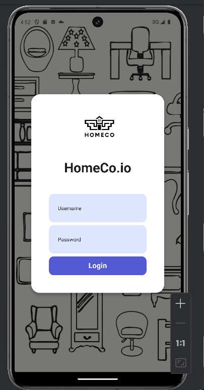
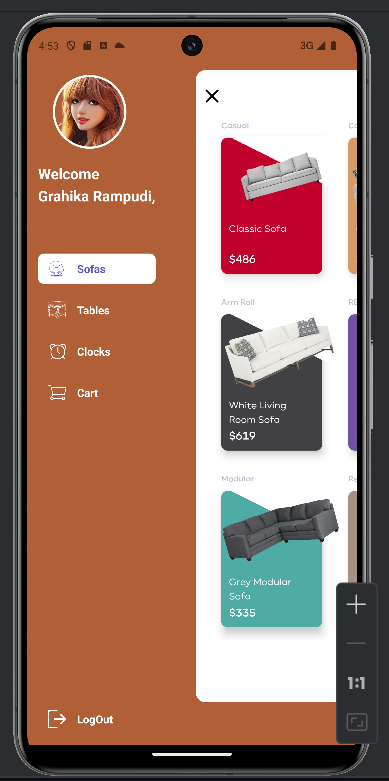
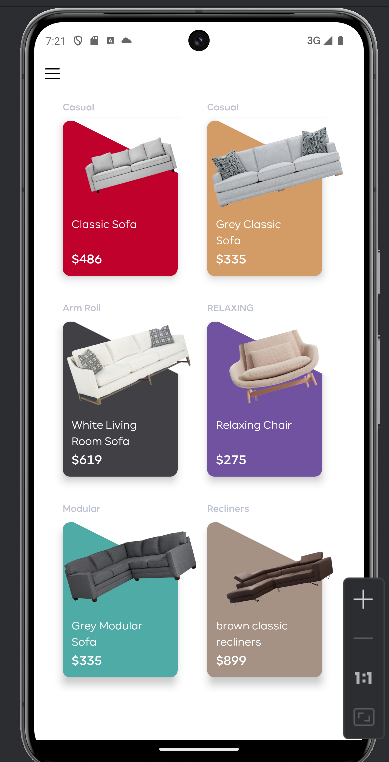
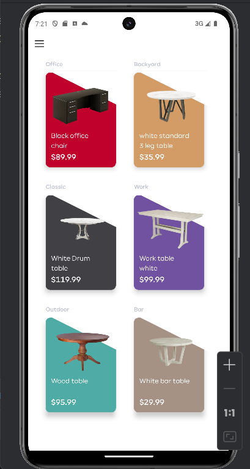
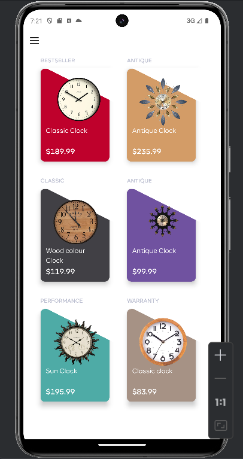

# HOMECO.io

## Student-1

**Name**: Grahika Rampudi

**Email**: rampudga@mail.uc.edu
## Student-2

**Name**: SaiSandeep Pasham

**Email**: pashamsp@mail.uc.edu
## Student-3

**Name**: Ruthvik Suvarnakanti

**Email**: suvarnrk@mail.uc.edu

**Overview**: Homeco.io is an innovative furniture shopping platform designed to revolutionize the online shopping experience. With a user-centric approach, the platform aims to simplify the often complex process of purchasing furniture and home decor items. By offering a streamlined shopping experience, Homeco.io reduces the number of steps required for users to find and buy their desired products, leading to increased customer satisfaction.

One of the standout features of Homeco.io is its efficient product categorization system, which organizes items like sofas, tables, and clocks into clear and intuitive categories. This design choice minimizes user confusion and enhances navigation, allowing customers to quickly locate the items they're interested in without getting lost in a cluttered interface.

Security is also a top priority for Homeco.io. The platform incorporates robust encryption measures during the login and checkout processes, ensuring that user data remains protected and confidential. This focus on security builds trust with users, encouraging them to shop with peace of mind from start to finish.

Looking to the future, Homeco.io aims to expand its offerings beyond core shopping functionalities. Plans include incorporating community features to boost user engagement and exploring partnerships with merchants and advertisers. This strategic approach not only enhances the platform's appeal but also sets the stage for scalable growth, solidifying Homeco.io's position as a leading player in the online furniture market.

**Code Explanation**:  This React Native app uses React Navigation for screen navigation and features a tab bar at the bottom with tabs for categories like Sofas, Tables, Clocks, Cart, and Logout. The main component, MainApp, manages the current selected tab and the visibility of a sliding menu on the right side. The sliding menu can be toggled using a menu button and displays content based on the selected tab. Additionally, the app uses animations for the sliding menu, including scaling and translating effects. Custom fonts are loaded using the useFonts hook from Expo. The app's root component, App, sets up the navigation stack with two screens: Login and MainApp. Overall, the app provides a user-friendly interface for browsing different product categories and navigating between screens with smooth animations.

**Languages used**: JavaScript
**Platform used**: Visual Studio

The Loginpage looks like:

The Home page looks like:

The Sofa page:

The tables page:

The Clocks page:

